# Vertical Metrics

A repo for testing and documenting strategies for vertical metrics in fonts.

> [!WARNING]  
> This repo is a work in (a very early state of) progress. 
> It is currently a space for keeping notes and forming thoughts.

## Goals and Scope

This repo seeks to test various vertical metrics parameters, in several important/representative apps, to determine a strategy for vertical metrics.

Such a strategy should ideally...
- Be as consistent as reasonable possible, between different platforms and apps
- Be intuitive to use and to read, for each major platform and app
- Be simple enough to describe and adapt to achieve type design goals

The repo will also seek to provide documentation behind new checks contributed to [Font Bakery](https://github.com/fonttools/fontbakery) and [Fontspector](https://github.com/fonttools/fontspector/).

This testing will be based on Latin script and the information should apply to other scripts that are primarily set horizontally. For writing systems like Chinese, Japanese, and Korean, this information is incomplete.

## Recommended vertical metrics

> [!WARNING]  
> This recommendation is an evolving hypothesis, based on incomplete testing.

Apply to all styles within a family:

```py
# Set up your target line height
Line Height = UPM * 1.4 # your preferred ratio, probably at least 1.2 or greater

# hheaAscender must exceed /Agrave, or you should increase your target Line Height
hheaAscender   = Cap Height + ((Line Height - Cap Height) / 2)
hheaDescender  = Cap Height - hheaAscender
hheaLineGap    = 0

# typoAscender controls framing in InDesign
typoAscender   = Cap Height
typoDescender  = hheaDescender
typoLineGap    = absolute value of hheaDescender # positive value

# important, or macOS app line height will be wrong in e.g. TextEdit
useTypoMetrics = False

# Sets default line heights and clipping heights in MS Word, etc
winAscent      = hheaAscender # or set to yMax if it is greater than hheaAscender and avoiding clipping is more important than cross-platform similarity
winDescent     = absolute value of hheaDescender # positive value # or absolute value of yMin if this is greater than hheaDescender and avoiding clipping is more important than cross-platform similarity
```

If the above terms are unfamiliar to you, or if you want to understand why the above recommendations are made, read on!

## What are vertical metrics?

The metrics discussed here are a little more technical, and used to determine the default positioning of lines of text within apps.

> [!NOTE]  
>  The “ascender” and “descender” values discussed here are specific to the overall line height of fonts. They are *not* the same as the basic “ascender” and “descender” values set in most font editors. Those basic values are mostly to set up helpful design guidelines for drawing letters, though they are sometimes used to determine actual vertical metrics values. Usually, the vertical metrics discussed here are set in custom parameters or other slightly deeper font info settings.
> See [Setting vertical metrics in font editors](#setting-vertical-metrics-in-font-editors), below, for more details.

“Vertical metrics” are values recorded in OpenType fonts, and are usually used by text-setting software use to determine:

1. The default offset applied to the first line of text within its space.
2. The default distance between lines of text.
3. The default offset applied between the last line of text and the bottom of its space.

Most text-setting software gives the ability to override these defaults, to varying degrees. For example, setting the `line-height` CSS property in browsers will override the default line-height that was determined by the vertical metrics – but the relative height of letters within their space (i.e. "vertical centering") is still affected by vertical metrics.

There are three systems for recording these values: `typo`, `hhea`, and `win` values. The specific values this repo focusses on are the following:

- **hheaAscender** – the `ascender` value of the [hhea table](https://learn.microsoft.com/en-us/typography/opentype/spec/hhea)
- **hheaDescender** – the `descender` value of the [hhea table](https://learn.microsoft.com/en-us/typography/opentype/spec/hhea)
- **hheaLineGap** – the `lineGap` value of the [hhea table](https://learn.microsoft.com/en-us/typography/opentype/spec/hhea)
- **typoAscender** – the [`sTypoAscender`](https://learn.microsoft.com/en-us/typography/opentype/spec/os2#stypoascender) value of the OS/2 table
- **typoDescender** – the [`sTypoDescender`](https://learn.microsoft.com/en-us/typography/opentype/spec/os2#stypodescender) value of the OS/2 table
- **typoLineGap** – the [`sTypoLineGap`](https://learn.microsoft.com/en-us/typography/opentype/spec/os2#stypolinegap) value of the OS/2 table
- **winAscent** – the [`usWinAscent`](https://learn.microsoft.com/en-us/typography/opentype/spec/os2#uswinascent) value of the OS/2 table
- **winDescent** – the [`usWinDescent`](https://learn.microsoft.com/en-us/typography/opentype/spec/os2#uswindescent) value of the OS/2 table
- **useTypoMetrics** – Bit 7 of the [`fsSelection`](https://learn.microsoft.com/en-us/typography/opentype/spec/os2#fsselection) value of the OS/2 table. (fsSelection is a uint16 value, which are numbered 15 to 0, so Bit 7 is in the _eigth_ column when counted from the right: `00000000 1️⃣0000000`.)

The exact names for the above values have slightly different labels between various font editors and the actual OpenType specification, but they are all fairly similar to the above.

## What does each of these metrics *really do?*

Based on testing, how can we describe the effects of each set of metrics?

In the OpenType spec for the [hhea table](https://learn.microsoft.com/en-us/typography/opentype/spec/hhea), it says: 

> The ascender, descender and linegap values in [the hhea] table are Apple specific; see [Apple's specification](https://developer.apple.com/fonts/TrueType-Reference-Manual/RM06/Chap6hhea.html) for details regarding Apple platforms. The sTypoAscender, sTypoDescender and sTypoLineGap fields in the OS/2 table are used on the Windows platform, and are recommended for new text-layout implementations.”

The Apple `hhea` documentation is not much more specific:

- ascent:	Distance from baseline of highest ascender
- descent: Distance from baseline of lowest descender
- lineGap: typographic line gap

So, let’s go deeper and see what values actually affect which apps, and how.

### `hhea` metrics

Generally, these set the top and bottom of lines of text in:
- macOS apps like TextEdit, which use CoreText
- Chrome on Mac (and FireFox and Safari on Mac)
- Chrome on Android, if _useTypoMetrics_ is False

For centered UI text (in buttons, etc) on the web, it is important for the full cap-height area to be centered between _hheaAscender_ and _hheaDescender_. (Or the cap-height can be just a little higher within line metrics, if you want to center the x-height a bit more.)

Mac apps have a quirk: if the _hheaAscender_ doesn’t exceed the /Agrave height, the system gives the font a significantly larger line height.

- [ ] Test: what happens in other web browsers?
- [x] Test: is Chrome on Windows the same as Chrome on Mac, or not?
- [ ] Test: what happens in Chrome on Android?
- [ ] Test (if possible): what about Android apps?

### `typo` metrics

Most significantly, these set the top of lines of text in Adobe InDesign.

In particular, the _typoAscender_ determines how a given font aligns to the top of text frames in InDesign, by default.

InDesign sets all fonts to a default line height of 120% (of their UPM), regardless of the total sum of *typoAscender*, *tyopDescender*, and *typoLineGap*.

The user has various ways around these defaults, but it is often most intuitive for the _typoAscender_ to be close to the cap height, or just above it.

If useTypoMetrics is set to true, more apps follow typo metrics (more information below).

- [ ] Test: what happens in other Adobe apps?
- [ ] Test: is this also true for Adobe apps on Windows? (It must be... right?)
- [ ] Test: what happens in Affinity apps, such as Affinity Designer and Affinity Publisher?

### `win` metrics

Generally, these set the top and bottom of each line in MS Word. This also sets where clipping occurs in glyphs.

If *useTypeMetrics* is not true, win metrics also set line heights in Chrome and Firefox on Windows.

If typo metrics differ from hhea metrics and *useTypeMetrics* is not true, win metrics are used by Chrome and Firefox on Windows.

- [ ] Test: what happens in other Windows apps?

### When *useTypoMetrics* is True

If *useTypoMetrics* is set to True, most apps follow the typo metrics. 

However, this causes a few issues:
1. Mac apps now check if the typoAscender exceeds the /Agrave height, and apply tall metrics if not.
2. MS Word will follow the typo metrics, including for its clipping boundaries – regardless of what win metrics are set.
3. Because of issues 1 and 2, typo metrics *have to* be set well above the cap height, which can be unintuitive for InDesign users.
4. Chrome on Mac still follows hhea, while Chrome on Windows follows typo. So, browsers can have mismatches between platforms.
  1. When useTypoMetrics _is_ set, Windows Chrome & Firefox will split the typoLineGap and use half above and half below each line.

- [ ] re-test MS Word clipping at typo values. [According to GlyphsApp docs, this should only happen in pre-2006 Office](https://glyphsapp.com/learn/vertical-metrics#:~:text=legacy%20Office%20software%20(i.e.%2C%20pre%2D2006)%20may%20apply%20clipping%20at%20the%20typo%20values%20rather%20than%20at%20the%20win%20values.)... but I am pretty sure it happens in my current version of MS Word for Windows 11

## Tested Strategies

All tested strategies share some basic features:
- Vertical metrics are set the same for all styles of a family


### Google Fonts

See the [full recommendations](https://googlefonts.github.io/gf-guide/metrics.html) for details. They basically boil down to:

```py
typoAscender   = Must exceed /Abreveacute (or, at a minimum, above /Agrave)
typoDescender  = capHeight - typoAscender
typoLineGap    = 0

useTypoMetrics = True

# Must match typo metrics
hheaAscender   = typoAscender
hheaDescender  = typoDescender
hheaLineGap    = 0

winAscent      = yMax in family
winDescent     = absolute value of yMin in family # positive value

# The sum of the font’s vertical metric values (absolute) should be 20-30% greater than the font’s UPM
# This may need to be greater for scripts outside of Latin, Cyrillic, and Greek (e.g. Devanagari)
```

### Google Fonts Min

Similar to "Google Fonts" strategy, but:
- *typoAscender* (and *hheaAscender*) set equal to top of /Agrave, which is the minimum suggested by the Google Fonts Guide

### Google Fonts Min Alt

Similar to "Google Fonts Min" strategy, but:
- Typo metrics set similar to Target Line Height strategy, with *typoAscender* at cap height and *typoLineGap* set to make up difference to `hhea`

### Target Line Height

Similar to Google Fonts strategy, but:
- Starts with a target line height (and adjusts if it’s too small)
- Sets `hhea` metrics based on target line height
- Sets *typoAscender* specifically for InDesign, then uses *typoLineGap* to make up the difference to `hhea` line height
- Sets *useTypoMetrics* to False, to allow hhea and win metrics to function well in other apps

```py
# Set up your target line height
Line Height = UPM * 1.4

# hheaAscender must exceed /Agrave, or you should increase your Line Height
hheaAscender   = Cap Height + ((Line Height - Cap Height) / 2)
hheaDescender  = Cap Height - hheaAscender
hheaLineGap    = 0

# typoAscender controls framing in InDesign
typoAscender   = Cap Height
typoDescender  = hheaDescender
typoLineGap    = absolute value of hheaDescender # positive value

# important, or macOS app line height will be wrong in e.g. TextEdit
useTypoMetrics = False

# Sets default line heights and clipping heights in MS Word, etc
winAscent      = yMax in family
winDescent     = absolute value of yMin in family # positive value
```

### Target Line Height B

Like "Target Line Height", but with the following changes:
- Matches `win` values to `hhea`, to match line heights at the expense of some possible clipping

```py
# Sets default line heights and clipping heights in MS Word, etc
winAscent      = hheaAscender
winDescent     = absolute value of hheaDescender # positive value
```

### Adobe Fonts

- [ ] todo: add this test? GlyphsApp does call this a "Legacy" strategy, however

### GlyphsApp Defaults

Based on some experimentation, it seems that the GlyphsApp default strategy (if custom parameters are left unset) is the following.

```py
# highest and lowest Y coordinates in the font are y=1300 and y=-700

# typoAscender controls framing in InDesign
typoAscender   = Basic "ascender" value of font
typoDescender  = Basic "descender" value of font
typoLineGap    = UPM - typoAscender

# hheaAscender must exceed /Agrave, or you should increase your Line Height
hheaAscender   = (UPM * 1.2) - basic "descender" value of font
hheaDescender  = typoDescender
hheaLineGap    = 0

useTypoMetrics = False

# Sets default line heights and clipping heights in MS Word, etc
winAscent      = hheaAscender
winDescent     = absolute value of hheaDescender
```


## Why not just use the Google Fonts strategy?

There are several metrics strategies, but one of the most common is [the “Google Fonts” strategy for vertical metrics](googlefonts.github.io/gf-guide/metrics.html). It is used for all (or almost all) fonts on Google Fonts, and these fonts have massive usage. It is also suggested by a collection of checks within [Font Bakery](https://github.com/fonttools/fontbakery) and [Fontspector](https://github.com/fonttools/fontspector/), which further reinforces its dominance.

However, there are a few pitfalls of the Google Fonts strategy.

- It is web-focused, and does not create intuitive results for Adobe InDesign.
  - It suggests setting the typoAscender to exceed the /Abreveacute (Ắ). In InDesign, this pushes the first line of text significantly downwards from the top of the text frame, which can make it challenging to align text. (This is solvable by diving into text frame options, but it would be preferable to not require users do this.)
- It suggests that setting win metrics to exceed the min and max Y values of a family will prevent Microsoft Word from clipping shapes in the font. However, it also requires setting "Use Typo Metrics" to True, which causes MS Word to ... use Typo metrics ... at which point, clipping still *does* occur (as of Microsoft Word in Windows 11).
- It is biased towards the needs of fonts within the context of web UI.
  - It suggests centering caps within the typo/hhea metrics, which is very helpful in web UI, but may not always work well for fonts with atypical sizing relationships. In particular, many script fonts have a very low x-Height (relative to Cap Height), and may also have very tall swashes.
- It doesn’t allow the designer to start with a *target* line height, and is instead just a series of glyphs to exceed. So, if a designer wants to satisfy the Google Fonts guidelines, but also make a default line height of 1.5x UPM, they have to understand a lot to get there.

## Test approach

1. Create a Glyphs source which...
   1. Uses individual Exports settings to vary vertical metrics for testing different approaches.
   2. Includes glyphs that contains vertical measurements, which will have alternates which are exported specific to different test exports. (See diagram below)
2. Build via FontMake
3. Test each export in multiple apps and platforms, with screenshots to document results.
   1. Chrome
      1. Safari?
      2. Firefox?
   2. Mac TextEdit (CoreText)
   3. Adobe InDesign
   4. Adobe Illustrator
   5. MS Word on Windows
   6. MS Word on Mac
   7. Android?
   8. iOS?
   9. Maybe create a submission process, if others wish to contribute their own screenshots?
4. Store those screenshots, with additional notes as needed, in this repo.

Test text (the question and exclamation glyphs store metrics diagrams):

```
HẮÀbỵ? !
HẮÀbỵ?!
HẮÀbỵ? !
```

Test fonts have their /question (?) glyph replaced with a diagram which shows their vertical metrics values:

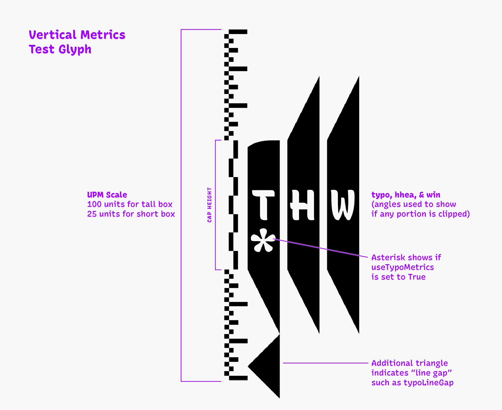

## Test Results

### InDesign

Observations:
- Follows typo metrics for top alignment, regardless of *useTypoMetrics* setting.
- Gives default line height of 120% (Justification > Auto Leading, Shift+Command+Option+J), regardless of font metrics.

Opinions:
- Reasonable results come from setting typoAscender to Cap Height or basic Ascender value, with *useTypoMetrics* set to False.
- Google Fonts approaches result in an unintuitive space at the top of text frames.

Additional notes:
- Sets all fonts to a line height of 120% (of the UPM), by default. This can be adjusted in Justification settings (Shift+Option+Command+J) > Auto Leading 
- Sets top of text based on typoAscender. This can be changed per text frame: right click on text frame, go to Text Frame Options (Command+B) > Baseline Options > First Baseline, and you can choose a different Offset basis.

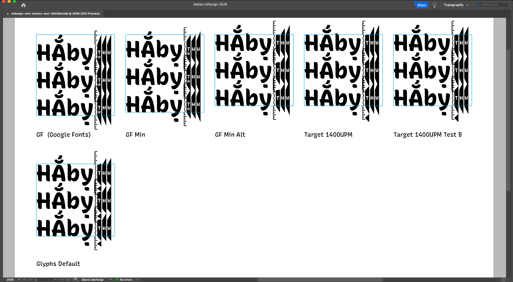

### Illustrator

Vertical metrics have little to no bearing on font alignment in Illustrator.

By default, fonts are aligned so that the top of lowercase ascenders sets the offset from the top of the frame.

Illustrator text Modes:
- In “Area Type” mode (ideal for text blocks), the top of lowercase ascenders sets the offset from the top of the frame, and the user controls the rest.
  - If text is highlighted (e.g. for editing), the highlight height is set by typoAscender–typoDescender (typoGap is not included, if present)
- In “Point Type” mode (ideal for short lines of text), the minimum text frame top is set by the lowercase ascenders, and will scale if taller glyphs are typed. If a very tall glyph is typed, the text frame expands to fit it. The minimum text frame bottom appears to be set by the lowest y value in the font*.

Additional notes:
  - Sets all fonts to a line height of 120% (of the UPM), by default.
  - Going from Area Type and Point Type retains the baselines of text. However, going from Point Type to Area Type moves type up to the top of the Point Type frame. (Does this matter to type designers? Probably not much. It is interesting and a bit odd, though!)

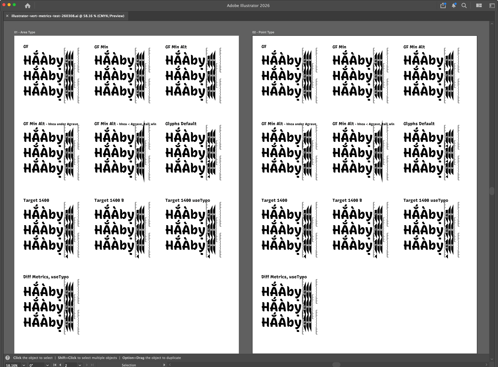

### macOS TextEdit (CoreText)

Observations:
- TextEdit gives a default Line Space of 1.2 × the distance of `hheaDescender` to *hheaAscender*
- The standard Google Fonts approach yields line heights that are tall relative to other approaches (about 155% of UPM, vs around 140%).
- TextEdit bases line heights on hhea metrics, regardless of *useTypoMetrics* setting.
- If the hheaAscender is lower than the y Max of a font, shapes in the first line which exceed the hheaAscender, will be cut off.

At a user-set Line Space of 1.0:
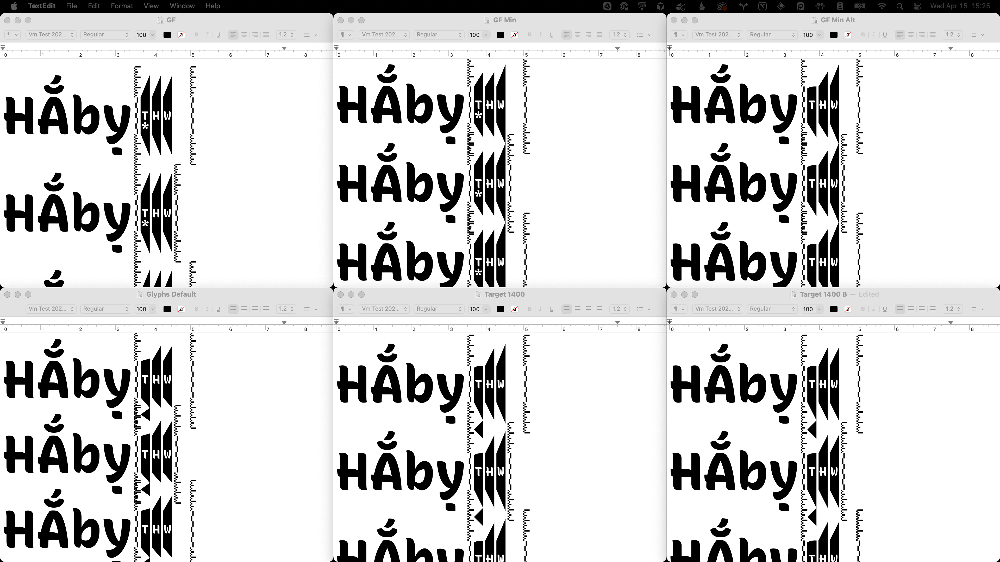

At a user-set Line Space of 1.2:


<details>
<summary>
TextEdit bases line heights on hhea metrics, even if *useTypoMetrics* setting is True
</summary>

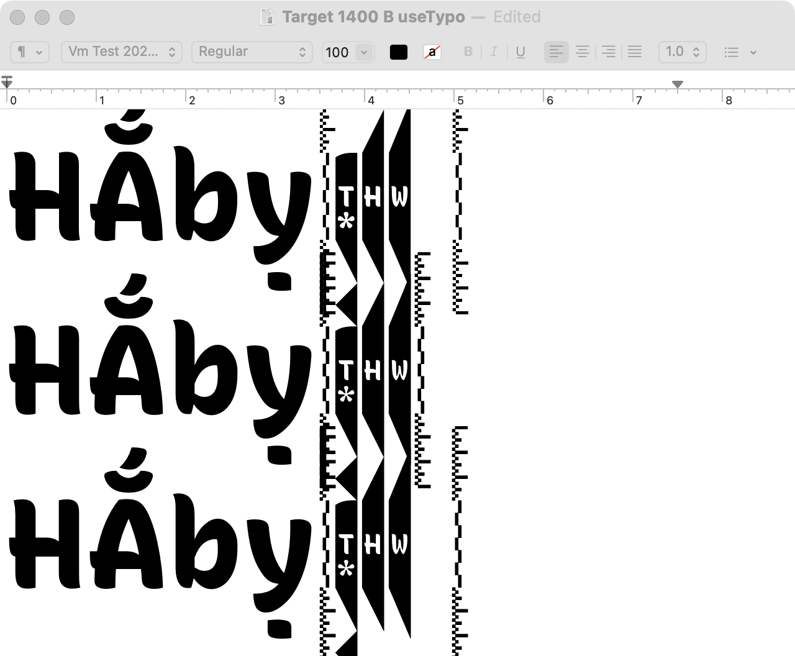

</details>

<details>
<summary>
Test: hheaAscender slightly lower than /Agrave
</summary>

If *hheaAscender* is lower than the height of the /Agrave font, macOS ignores hhea metrics, and instead gives much taller height.

Notably, it doesn’t matter what typoAscender is, or whether *useTypoMetrics* is true. It doesn’t follow win Metrics. It appears to assign a line height of 150% of the UPM.

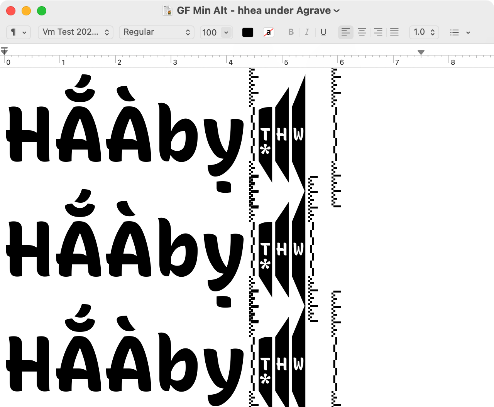

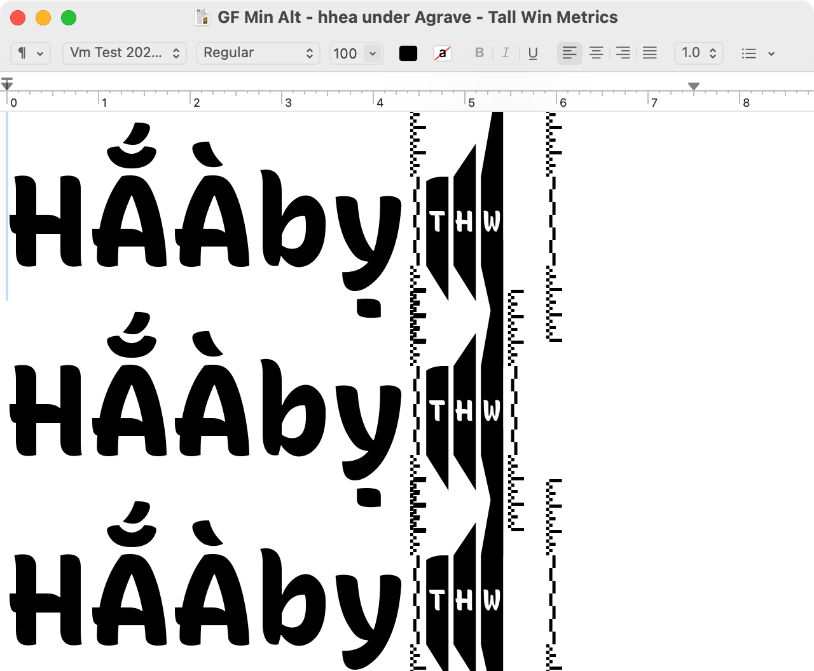

</details>


- [ ] test on latest version of macOS
- [ ] test and screenshot impact of /Agrave exceeding typo ascender, and also hhea ascender

### Windows 11 Word

Observations
- Default line spacing is 1.08, with 8pt after each paragraph.
- To understand how MS Word decides line height, you need to adjust to Line Spacing: Single.
- MS Word uses Win metrics to set line metrics, or typo metrics if *useTypoMetrics* is True.
- If *useTypoMetrics* is True, shapes get clipped at the typo metrics. If *useTypoMetrics* is False, shapes do not get clipped aside from tall parts of the first line on a page.
- If any clipping is unacceptable, it is important to set Win metrics past the highest/lowest coordinates. If *useTypoMetrics* is True, typo metrics must also be set past the highest/lowest coordinates.
- Aside: it is important to keep short family names (31 characters or fewer) for test fonts, or the /Abreveacute will not be displayed. See Font Bakery check [name/family_and_style_max_length](https://github.com/fonttools/fontbakery/blob/9a85e003d36ebfbbfe68c6d362e5db5a6434332c/Lib/fontbakery/checks/name/family_and_style_max_length.py).

Opinions
- "Target Line Height B" works best here. It is nice to set Win metrics to match hhea metrics, for better consistency between Word and other apps. If your target line height is close to your highest/lowest points, only the first line may have a small amount of clipping in the tallest shapes. If this is unacceptable, it is better to set win metrics equal to highest/lowest points.
- The Google Fonts approach also works relatively well, but it is pretty tall, and it would clip anything taller than the Abreveacute (such as possible tall swashes).

The following screenshots have Line Spacing set to “Single.” By default, they are slight taller (1.08).

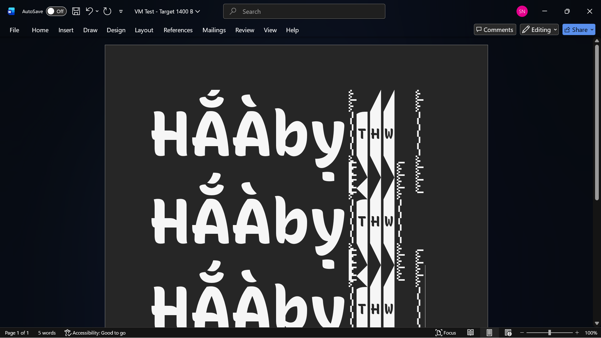
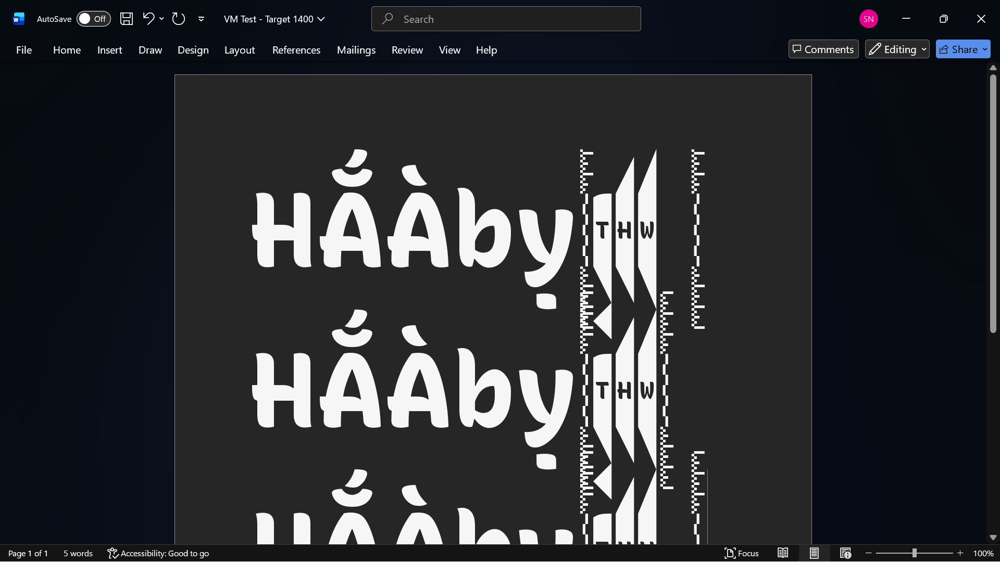
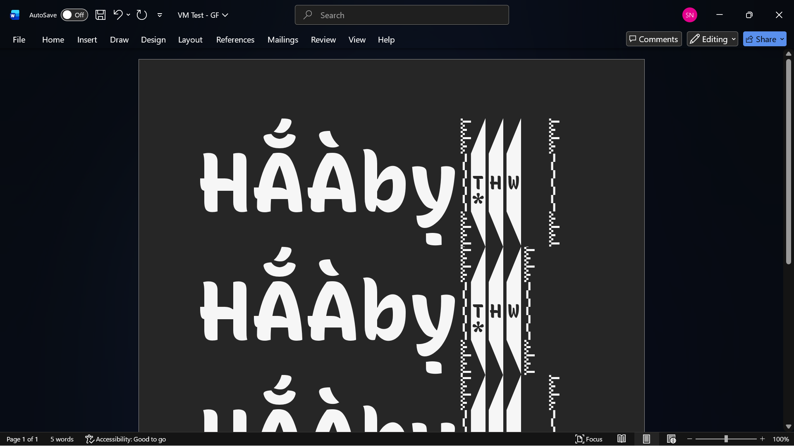

<details>
<summary>
Additional test screenshots from Windows
</summary>

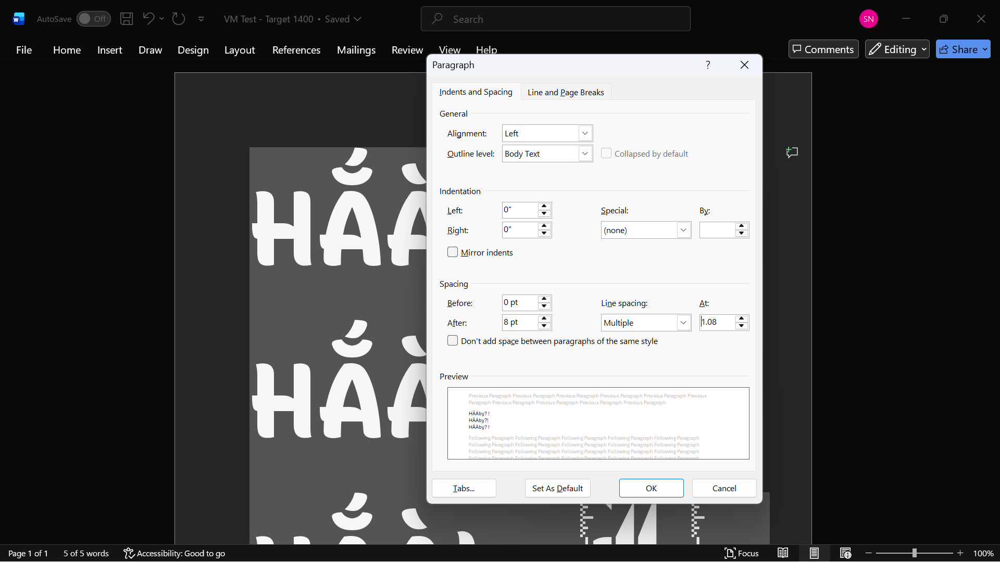

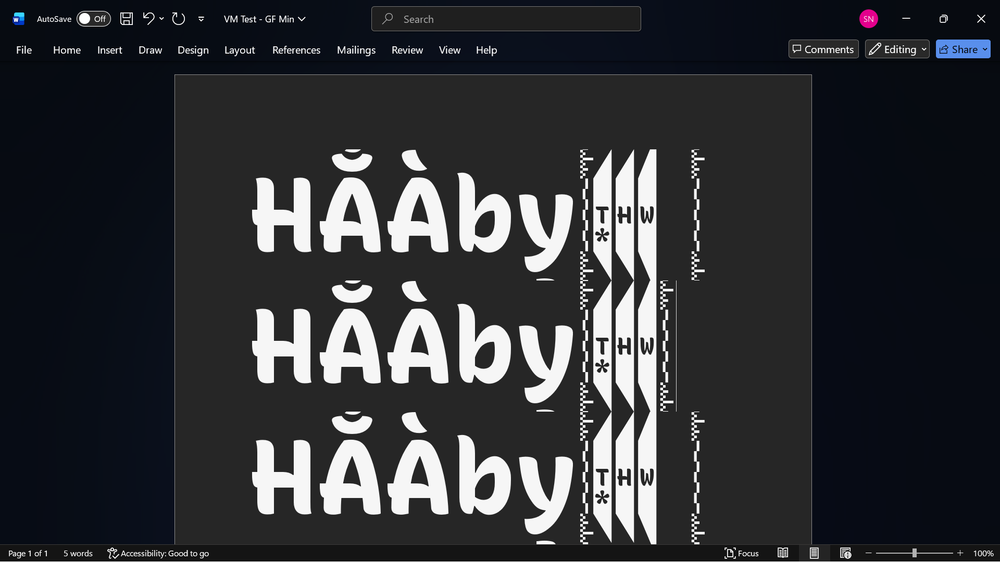
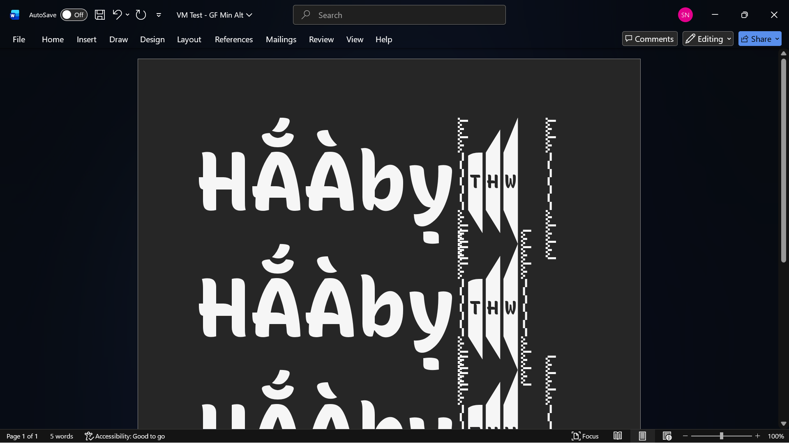
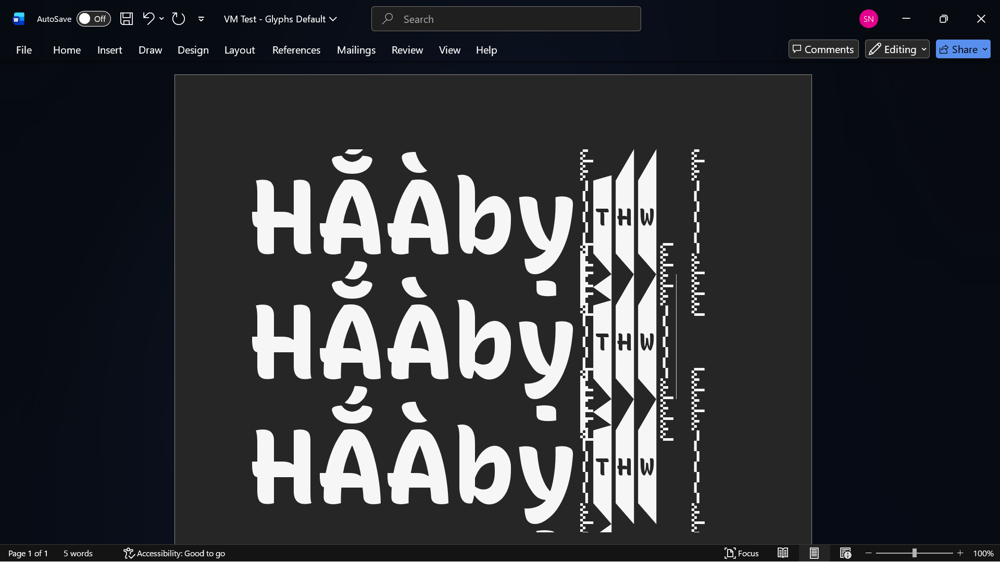

</details>

### Chrome

- [ ] TODO: test the following, and edit details if necessary.

Acts a little differently, depending on OS.

Previous testing has shown that Chrome follows hhea metrics, or typo metrics if *useTypoMetrics* is True.

This is only the case for the default line height, shown when `line-height` CSS is not set.

When `line-height` CSS *is* set, the line height is based on the font’s UPM.

- [ ] screenshot with `line-height` CSS set
- [ ] screenshot without `line-height` CSS set
- [ ] Determine whether Firefox and Safari match Chrome


### Affinity 

(Tested on Mac, Version: Mid June 26 (4557).)

Seems to align text with top set to the basic lowercase ascender, e.g. the top of /b. (Would need more testing to be certain of this.)

Sets default line height based on hhea metrics, regardless of whether *useTypoMetrics* is set.

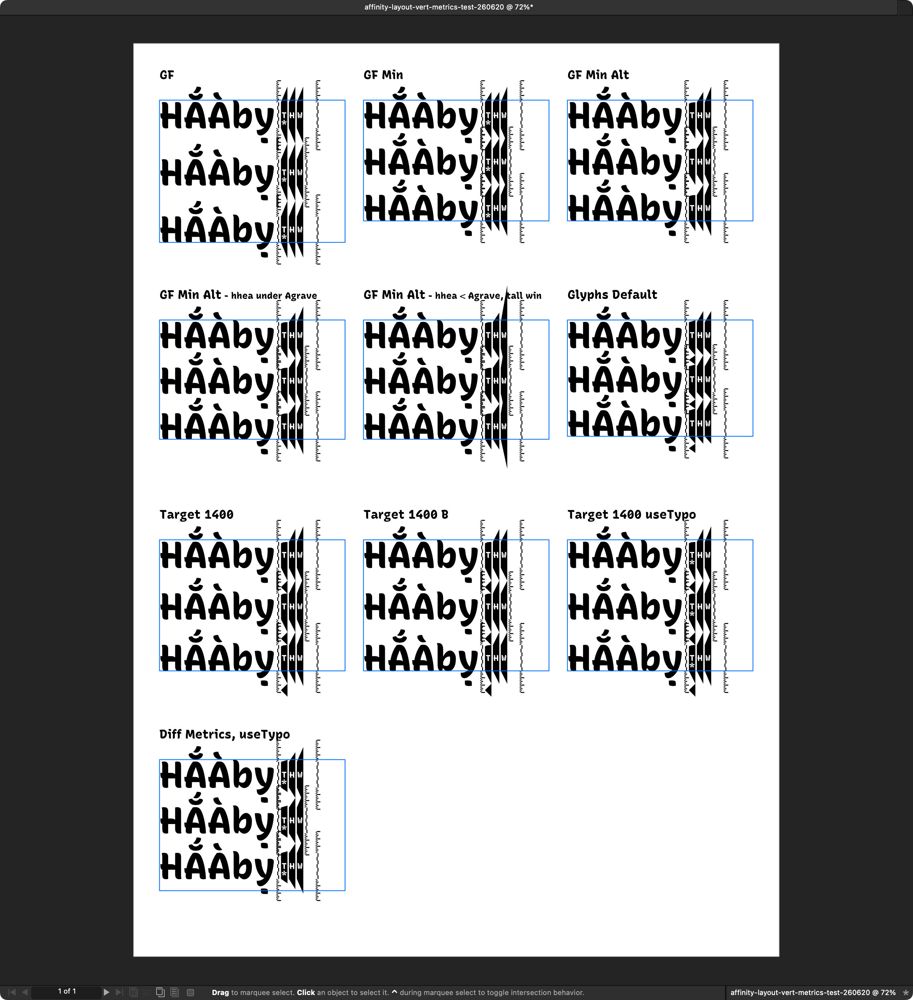


## Setting vertical metrics in font editors

- [ ] TODO: maybe :)

- GlyphsApp
- RoboFont
- FontLab


## Note on CJK fonts

In the [OpenType specification for OS/2 typoAscender](https://learn.microsoft.com/en-us/typography/opentype/spec/os2#stypoascender), it says:

> For CJK (Chinese, Japanese, and Korean) fonts that are intended to be used for vertical (as well as horizontal) layout, the required value for sTypoAscender is that which describes the top of the ideographic em-box.

Along with CJK vertical metrics in general, this has not been tested (yet) in this repo, but it is probably sound advice. It is mentioned here because “required value” is pretty strong language, so any future CJK testing should most likely adhere to this requirement.

## Build

First, you need Python installed. You can get it from python.org if you haven’t yet installed it.

Then, you can run the setup:

`make setup`

Finally, run the build:

`make build`


## Contributing

This project is inherently limited, and can’t feasibly test all possible combinations of vertical metrics, applications, and operating systems. Instead, it attempts to be relatively thorough in testing applications subjectively considered to be “high priority” text environments. That is, if you are a type designer, and you are primarily focused on making fonts for graphic designs, agencies, and brands, you probably want to know how metrics operate in the apps tested, here.

That said, contributions are very welcome!

If you have suggestions or questions, please [file them in an Issue](https://github.com/arrowtype/vertical-metrics/issues). Better yet, if you do some testing of your own and learn something new, please file an Issue, along with screenshots, notes about what you learned from your test, and details of the app & OS versions.

If you spot any typos or simple mistakes, please don’t hesitate to [make a Pull Request](https://github.com/arrowtype/vertical-metrics/pulls) with a fix!


## Credits

Many thanks to:
- [The Type Founders](https://thetypefounders.com/), for supporting this testing and research, and encouraging it to be openly published.
- [Google Fonts](https://fonts.google.com/), for informing this approach and documentation, as well as for their support of foundational tools used here.
- (More credits to be added!)
- ArrowType (Stephen Nixon) for the primary design, writing, and testing done for this repo


## Background Resources

- [OpenType Spec: OS/2 Table](https://learn.microsoft.com/en-us/typography/opentype/spec/os2)
- [OpenType Spec: hhea Table](https://learn.microsoft.com/en-us/typography/opentype/spec/hhea)
- [OpenType Spec: Recommendations](https://learn.microsoft.com/en-us/typography/opentype/spec/recom#tad)
- [Google Fonts Guide: Vertical Metrics](https://googlefonts.github.io/gf-guide/metrics.html)
- [GlyphsApp article on Vertical Metrics](https://glyphsapp.com/learn/vertical-metrics)
